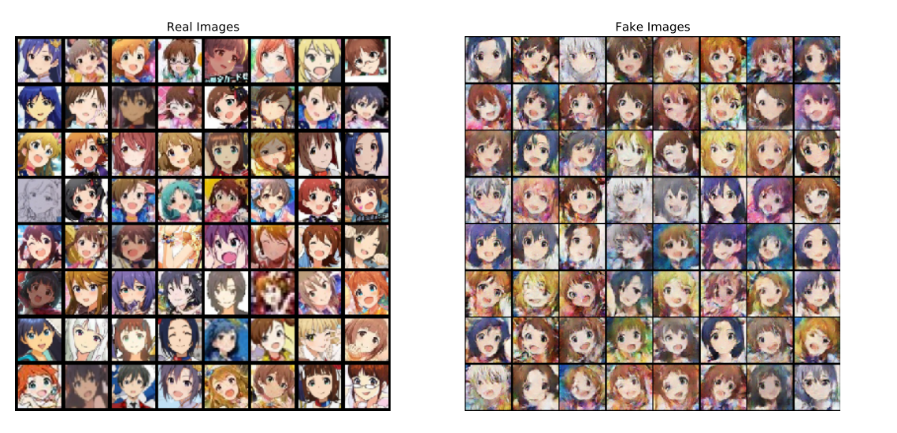

基于DCGAN的im@s脸生成器（训练中）

Descriminator与Generator位于model/

### 参考资料

DCGAN TUTORIAL

https://pytorch.org/tutorials/beginner/dcgan_faces_tutorial.html

使用 OpenCV 进行动漫人脸检测_Lbpcascade_animeface.xml

https://ultraist.hatenablog.com/entry/20110718/1310965532

AutoCrawler_谷歌图片关键词下载

https://github.com/YoongiKim/AutoCrawler

### 问题

1. 试图使用ONNX将模型上传到JS，但有部分算符不支持（如conv2d等），需要替换
2. DCGAN 论文中使用的NN结构前提是训练集全部为64*64大小，如果要改变训练集与产出图片大小可能需要改变结构
